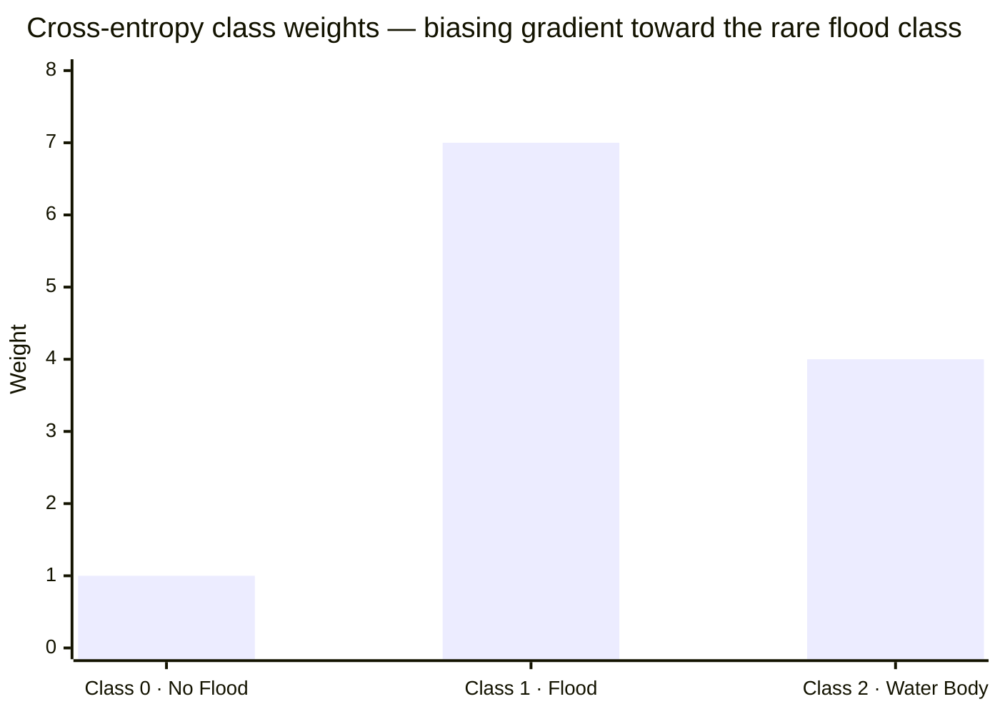
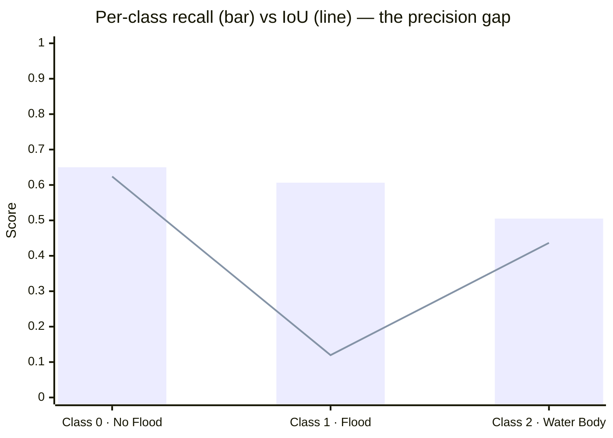
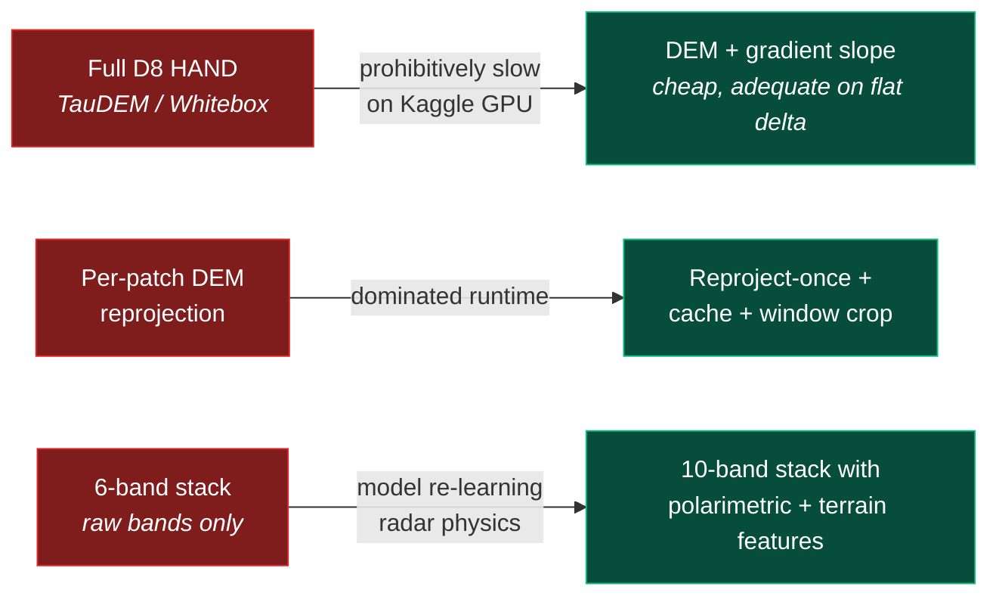
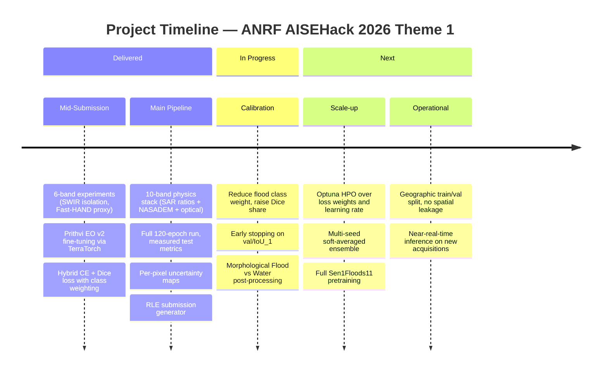

<div align="center">

# DeepSARFlood

### Physics-Informed Flood Segmentation with Foundation-Model Fine-Tuning

**Team ENDRA** · ANRF AISEHack 2026 · Theme 1 — Flood Segmentation · West Bengal, India

[](#the-problem)
[](https://huggingface.co/ibm-nasa-geospatial/Prithvi-EO-2.0-100M-TL)
[](#training-recipe)
[](https://github.com/IBM/terratorch)
[](#feature-engineering)
[](#results)
[](LICENSE.md)

Mapping flood inundation across the Ganges–Brahmaputra delta from a single Sentinel-1 pass —
no pre-event image, no cloud-free optical, no temporal stack required at inference.

</div>

---

## Contents

| Section | What's inside |
|---|---|
| [The Problem](#the-problem) | Why three-class flood mapping from SAR is hard |
| [Approach](#approach) | The one-paragraph version |
| [Architecture](#architecture) | End-to-end pipeline diagram |
| [Feature Engineering](#feature-engineering) | The 10-band physics stack |
| [Training Recipe](#training-recipe) | Loss, class weights, hyperparameters |
| [Results](#results) | Measured metrics and error analysis |
| [Challenges and Pivots](#challenges-and-pivots) | What broke and what we did about it |
| [Roadmap](#roadmap) | Delivered vs. planned |
| [Repository Structure](#repository-structure) | Where everything lives |
| [Quickstart](#quickstart) | Run it yourself |
| [Team](#team) | Credits and license |

---

## The Problem

Flood extent mapping from Sentinel-1 SAR is a three-class semantic segmentation problem:

| Class | Label | Description | Difficulty |
|:---:|:---|:---|:---|
| **0** | `No Flood` | Dry land, urban, vegetation | Majority class — easy, but dominates the loss |
| **1** | `Flood` | Transient inundation | **Rare** (<5% of pixels) — *this is the scored class* |
| **2** | `Water Body` | Rivers, lakes, reservoirs | Confusable with Class 1 — identical SAR signature |

### Why it's hard

- **SAR backscatter alone cannot separate flood water from permanent water.** Both are specular reflectors, so both appear dark. Same signal, different class.
- **Optical imagery is unusable during active floods** — cloud cover peaks exactly when the flood does.
- **No pre-event SAR pair at inference time**, which blocks classic change detection.
- **Flood pixels are under 5% of the image**, so unweighted cross-entropy collapses to background.
- **The study area is the Ganges delta: mean elevation ≈ 2.4 m.** There is almost no terrain relief to separate "floodable" from "dry".

In one line: the model has to infer *where water shouldn't be* from a single dark-pixel image, on land that is barely above sea level.

---

## Approach

We stop asking the network to rediscover radar physics and hydrology from scratch. Instead of feeding raw SAR bands into a generic CNN, we pre-compute the physics — polarimetric ratios, terrain elevation, slope — and fuse them with the optical bands into a purpose-built **10-band stack**, then fine-tune **Prithvi-EO-2.0**, NASA/IBM's Earth-observation foundation model, on top of it.

<table>
<tr>
<td width="33%" valign="top">

**Foundation model**
`Prithvi-EO-2.0-100M-TL`

A ViT pre-trained on global multi-spectral EO imagery. Its attention already understands terrain texture at continental scale, so we only adapt it. 121M trainable parameters with the UperNet head.

</td>
<td width="33%" valign="top">

**Polarimetric features**
`10·log₁₀(HH−HV)` and `HH/HV`

The physically canonical representations in radar hydrology — computed *before* the network rather than learned from scratch.

</td>
<td width="33%" valign="top">

**Flood-biased loss**
`0.4·CE + 0.6·Dice`

Dice is class-frequency agnostic; the 7× flood weight on cross-entropy stops the model collapsing to all-background on a sub-5% class.

</td>
</tr>
</table>

---

## Architecture

```mermaid
flowchart TD
    A["<b>Competition Patches</b><br/>6-band Sentinel-1 + optical<br/><i>HH · HV · G · R · NIR · SWIR</i>"]
    A2["<b>NASADEM HGT</b><br/>30 m SRTM tiles via earthaccess<br/><i>BBOX 86.5–89.0°E, 21.5–24.5°N</i>"]

    subgraph PREP ["Stage 1 — Feature Engineering &nbsp;<i>(offline, per-patch)</i>"]
        direction TB
        C["<b>DEMDownloader</b><br/>search + fetch NASADEM_HGT"]
        D["<b>DEMProcessor</b><br/>unzip → rasterio.merge mosaic"]
        E["<b>DeepFeatureStacker</b><br/>reproject to scene CRS · cache<br/>window-crop · resize · ∇ slope"]
        C --> D --> E
    end

    F["<b>10-Band Physics Stack</b><br/>HH · HV · LogDiff · Ratio · DEM · Slope<br/>Green · Red · NIR · SWIR"]

    subgraph TRAIN ["Stage 2 — Model"]
        direction TB
        G["<b>Per-band normalisation</b><br/>corpus μ/σ (10 channels)"]
        H["<b>Albumentations</b><br/>H/V flip · Rotate90 · CoarseDropout"]
        I["<b>Prithvi-EO-2.0 Encoder</b><br/>ViT · pretrained · 121M params<br/>neck: ReshapeTokensToImage"]
        J["<b>UperNetDecoder</b><br/>512 ch · multi-scale FPN"]
        K["<b>Head</b><br/>Dropout 0.4 → Conv1×1 → 3 logits"]
        G --> H --> I --> J --> K
    end

    L["<b>Hybrid Loss</b><br/>0.4·CE(w=[1,7,4]) + 0.6·Dice<br/><i>ignore_index = −1</i>"]

    subgraph POST ["Stage 3 — Inference"]
        direction TB
        M["<b>Argmax</b> → 3-class mask<br/><i>int16 · nodata −1 · LZW</i>"]
        N["<b>Uncertainty map</b><br/>per-pixel confidence raster"]
        O["<b>RLE encoding</b><br/>Class 1 only · empty ⇒ <code>0 0</code>"]
        M --> N --> O
    end

    P["<b>submission.csv</b><br/>(id, rle_mask)"]

    A --> PREP
    A2 --> PREP
    PREP --> F --> TRAIN --> L
    L -.->|backprop| TRAIN
    TRAIN --> POST --> P

    classDef input fill:#0EA5E9,stroke:#0369A1,stroke-width:2px,color:#fff
    classDef stack fill:#7C3AED,stroke:#5B21B6,stroke-width:2px,color:#fff
    classDef loss  fill:#F59E0B,stroke:#B45309,stroke-width:2px,color:#000
    classDef out   fill:#00C896,stroke:#047857,stroke-width:2px,color:#000
    class A,A2 input
    class F stack
    class L loss
    class P out
```

---

## Feature Engineering

The competition ships 6 bands. We ship 10 — and every added channel carries a hydrological or radar-physics meaning. Nothing is a raw pixel dump, and nothing is zero padding.

| # | Band | Formula / Source | μ | σ | Physical reasoning |
|:-:|:---|:---|--:|--:|:---|
| 1 | **HH** | Sentinel-1 GRD | 801.79 | 435.30 | Co-pol backscatter — open water is specular, so it reads dark |
| 2 | **HV** | Sentinel-1 GRD | 357.10 | 164.03 | Cross-pol — volume scattering; separates canopy from smooth water |
| 3 | **SAR LogDiff** * | `10·log₁₀(HH − HV)` | 24.37 | 9.41 | Decibel scale linearises SAR's multiplicative speckle noise |
| 4 | **SAR Ratio** * | `HH / HV` | 2.31 | 0.89 | Cross-pol ratio — canonical surface-roughness signature in radar hydrology |
| 5 | **DEM** * | NASADEM 30 m (earthaccess) | **2.38** | 2.38 | Absolute elevation — water does not climb |
| 6 | **Slope** * | `‖∇DEM‖` | 0.56 | 0.44 | Runoff physics — steep terrain sheds, flat terrain accumulates |
| 7 | **Green** | Optical | 1836.63 | 628.82 | Water-index input; high reflectance over turbid water |
| 8 | **Red** | Optical | 1688.38 | 615.60 | Vegetation and soil discrimination |
| 9 | **NIR** | Optical | 1812.14 | 588.76 | Strong vegetation response; water absorbs |
| 10 | **SWIR** | Optical | 1275.31 | 543.94 | Water absorbs SWIR almost totally — strongest passive water delineator |

<sub>* engineered by us. μ/σ computed corpus-wide and wired into the TerraTorch datamodule.</sub>

> [!NOTE]
> **That DEM mean is not a bug.** The study area — the Ganges–Brahmaputra delta of West Bengal — has a mean elevation of roughly 2.4 m with a standard deviation of the same magnitude. This is precisely why the region floods, and precisely why terrain alone cannot solve the task here: there is almost no relief to exploit. The DEM earns its channel by marking the handful of metres that separate a riverbank from a floodplain.

### Where the DEM comes from


The mosaic is reprojected and cached once in `DeepFeatureStacker.__init__`, then window-cropped per patch — avoiding a per-image reprojection that would otherwise dominate runtime. Edge patches falling outside the mosaic fall back to zero-filled DEM and slope rather than crashing.

---

## Training Recipe

<table>
<tr><th align="left" width="50%">Configuration</th><th align="left">Stack</th></tr>
<tr valign="top"><td>

| Parameter | Value |
|:---|:---|
| Backbone | `prithvi_eo_v2_100_tl` |
| Decoder | `UperNetDecoder` (512 ch) |
| Trainable params | 121 M (485 MB) |
| Learning rate | `3e-6` |
| Weight decay | `0.01` |
| Dropout (head) | `0.4` |
| Max epochs | `120` |
| Batch size | `6` (grad accum ×4 → eff. 24) |
| Precision | `16-mixed` (FP16 AMP) |
| Scheduler | `ReduceLROnPlateau` |
| Freeze backbone | `False` — full fine-tune |
| Seed | `42` |
| Wall-clock | ~18 min (Kaggle GPU) |

</td><td>

- **PyTorch Lightning** — training loop
- **TerraTorch** — `GenericNonGeoSegmentationDataModule`
- **rasterio** — GeoTIFF I/O, merge, reprojection
- **earthaccess** — NASADEM retrieval
- **albumentations** — flip, rotate90, CoarseDropout
- **OpenCV** — DEM resampling
- **TensorBoard** (+ LocalTunnel) — live metrics

**Augmentation**
```python
HorizontalFlip(p=0.5) · VerticalFlip(p=0.5)
RandomRotate90(p=0.5)
CoarseDropout(holes=1-4, 8-32px, p=0.2)
```

**Callbacks**
- `ModelCheckpoint(monitor="val/IoU_1", mode="max")`
- `LearningRateMonitor(logging_interval="step")`

</td></tr>
</table>

### The loss function

$$\mathcal{L} = 0.4 \cdot \text{CE}(w=[1.0,\ 7.0,\ 4.0]) \;+\; 0.6 \cdot \text{Dice}$$



| Component | Weight | Why it's there |
|:---|:---:|:---|
| **Dice** | `0.6` | Region-based and class-frequency agnostic — directly correlates with the scored IoU |
| **Cross-entropy** | `0.4` | Stable per-pixel gradients; prevents Dice's instability on near-empty masks |
| **Class weights** | `[1, 7, 4]` | 7× on flood stops collapse-to-background; 4× on water sharpens the Class 1/2 boundary |
| **`ignore_index`** | `−1` | No-data and ambiguous sub-pixel flood margins contribute zero gradient |

---

## Results

Measured on the held-out test split, using the best checkpoint
(`best-flood-epoch=12-val/IoU_1=0.1635.ckpt`) selected on `val/IoU_1`.

### Headline metrics

| Metric | Score |
|:---|:---:|
| **`test/IoU_1`** — Flood *(primary)* | **0.1196** |
| `test/mIoU` | **0.3933** |
| `test/mIoU_Micro` | 0.4334 |
| `test/F1_Score` | 0.5299 |
| `test/Accuracy` | 0.5873 |
| `test/Pixel_Accuracy` | 0.6047 |
| `test/Boundary_mIoU` | 0.1001 |
| `test/loss` *(ce 0.910 · dice 0.540)* | 0.6883 |

### Per-class breakdown



| Class | Recall *(Class_Accuracy)* | IoU | Reading |
|:---|:---:|:---:|:---|
| **0 · No Flood** | 0.6501 | 0.6239 | Recall ≈ IoU, so predictions are well-calibrated here |
| **1 · Flood** | 0.6065 | **0.1196** | **Recall is 5× the IoU** — the model finds flood but over-predicts it massively |
| **2 · Water Body** | 0.5052 | 0.4364 | Moderate gap; some bleed into Class 1 |

### Error analysis

> [!IMPORTANT]
> The headline number is low, and the gap tells us exactly why.

**1. The 7× flood weight bought recall and paid for it in precision.**
Class 1 recall is `0.61` — the model does see the flood. But IoU is `0.12`, which means the union is far larger than the intersection: it is flagging large regions of non-flood as flood. In a delta where nearly everything is 2 m above sea level and radar-dark, that is the expected failure. The weight is over-tuned; `[1, 3, 2]` with a higher Dice share is the first thing to try.

**2. Best checkpoint at epoch 12 of 120 — it overfit for the remaining 108.**
`val/IoU_1` peaked at `0.1635` very early and never recovered. Training ran nearly 10× longer than useful. Early stopping on `val/IoU_1` would have saved roughly 90% of the compute, and the gap between the validation peak (`0.1635`) and the test score (`0.1196`) suggests the validation split is also being partly fit through checkpoint selection.

**3. `Boundary_mIoU` of `0.10` confirms the diagnosis.**
Boundary IoU sitting at roughly a quarter of `mIoU` means the errors concentrate at class *edges* — exactly the Flood/Water Body frontier the whole feature stack was designed to attack. The morphological post-processing described in the finale deck is not yet wired into this notebook's inference path; that is the most direct available fix.

**4. What is genuinely working.**
The 10-band fusion pipeline runs end to end, the DEM co-registers correctly, Prithvi loads and fine-tunes without gradient shock, and `IoU_0 = 0.62` / `IoU_2 = 0.44` show the model has learned a real, physically structured decision boundary rather than predicting a constant. The problem is calibration on the rare class, not a broken pipeline.

### Where the next points come from

| Priority | Fix | Expected effect |
|:---:|:---|:---|
| 1 | Lower flood class weight to ~3, raise Dice share to `0.7` | Trades recall for precision — directly targets the IoU_1 gap |
| 2 | `EarlyStopping(monitor="val/IoU_1", patience=15)` | Roughly 10× cheaper runs, more experiments per budget |
| 3 | Wire morphological post-processing into inference | Attacks `Boundary_mIoU = 0.10` at the Class 1/2 edge |
| 4 | Proper geographic train/val split | Current split risks spatial leakage between adjacent patches |
| 5 | Optuna HPO over `lr`, `dice_weight`, class weights | Systematic instead of manual |
| 6 | Multi-seed soft-averaged ensemble | Variance reduction, typically 1–3 IoU points |

> [!NOTE]
> Competition test labels are not public. All metrics above are on our internal held-out split, produced by `trainer.test()` in the main notebook — the raw output table is preserved in the committed cell outputs.

### What a correct prediction looks like

| Class | Expected morphology | Cross-check |
|:---|:---|:---|
| **Flood (1)** | Thin, irregular, dendritic strips following drainage networks and terrain contours | Should sit in low-elevation, low-slope basins |
| **Water Body (2)** | Compact, polygon-like, smooth stable boundaries | Should spatially co-register with known rivers and channels |

This is the prior the planned morphological post-processing encodes: circularity $4\pi A / P^2 \to 1$ implies a compact permanent water body, while $\ll 1$ implies flood inundation.

---

## Challenges and Pivots

### Roadblocks hit

| Challenge | Detail | Mitigation |
|:---|:---|:---|
| **Class 1/2 confusion** | SAR backscatter suppression is identical for flood and open water | Polarimetric ratios plus optical SWIR; **not yet solved** — see `Boundary_mIoU` |
| **Flood over-prediction** | 7× class weight drove recall up and precision down | Identified; weight reduction is fix #1 |
| **Import collisions** | Kaggle base image conflicts with `terratorch` | Install to `/kaggle/temp/custom_libs`, then `sys.path.insert(0, …)` |
| **DEM / scene alignment** | NASADEM is in a geographic CRS, scenes in a projected one | `calculate_default_transform` + bilinear reproject, cached once |
| **Edge patches** | Patches outside the DEM mosaic produced empty crops | Explicit `dem_crop.size == 0` guard, falling back to zero-fill |
| **GPU memory** | Prithvi + UperNet is memory-hungry | FP16 AMP, gradient accumulation ×4, batch size 6 |
| **Class imbalance** | Flood pixels under 5% of the image | Class weights plus the Dice component |
| **No terrain relief** | Delta mean elevation ≈ 2.4 m | DEM retained, but contributes far less signal than in hilly terrain |

### Strategic pivots



---

## Roadmap



### Deliverables

| Deliverable | Format | Location |
|:---|:---|:---|
| **Main pipeline** | Jupyter notebook *(with outputs)* | [`notebooks/flood-detection-and-segmentation-west-bengal.ipynb`](notebooks/flood-detection-and-segmentation-west-bengal.ipynb) |
| Mid-submission experiments | Jupyter notebook | [`notebooks/AISE_Hack_MidSubmission.ipynb`](notebooks/AISE_Hack_MidSubmission.ipynb) |
| Finale presentation | PPTX *(generated)* | [`presentation/`](presentation/) |
| Mid-submission report | DOCX | [`docs/`](docs/) |
| Strategy and novelty write-up | Markdown | [`docs/midpoint-checkin.md`](docs/midpoint-checkin.md) |
| Competition submission | `submission.csv` — `(id, rle_mask)`, Class 1 only | generated at runtime |

---

## Repository Structure

```
Team-ENDRA-AISEHack/
│
├── notebooks/
│   ├── flood-detection-and-segmentation-west-bengal.ipynb   MAIN — 10-band, full run
│   └── AISE_Hack_MidSubmission.ipynb                        mid-submission experiments
│
├── docs/
│   ├── midpoint-checkin.md             strategy, novelty & technical deep-dive
│   └── AISE_MidSubmission.docx         official mid-submission report
│
├── presentation/
│   ├── generate_ppt.py                 builds the finale deck programmatically
│   ├── TeamENDRA_FinalPresentation.pptx  generated output
│   └── templates/
│       └── ANRFAISEHack_Template_FinalePresentation.pptx
│
├── assets/                             diagrams & figures
├── requirements.txt
├── LICENSE.md                          ANRF Open License (MIT-compatible)
└── README.md
```

### Main notebook anatomy

| Cells | Section | Key components |
|:---:|:---|:---|
| 0–5 | Environment | `terratorch` + `earthaccess` → `/kaggle/temp/custom_libs`, imports |
| 6–7 | Configuration | `Config` — single source of truth for paths, bands, μ/σ, hyperparameters |
| 8–14 | Data pipeline | `download_kaggle_competition()` · `DEMDownloader` · `DEMProcessor` · `DeepFeatureStacker` · `run_data_pipeline()` |
| 16–17 | Submission utils | `mask_to_rle()` · `generate_submission()` · `get_train_transforms()` |
| 18–20 | Model | `build_datamodule()` · `build_model()` · `get_loggers()`, plus architecture notes |
| 21 | Training & inference | `generate_phase2_submission()` · `main()` — fit → test → predict → uncertainty maps |
| 22 | Monitoring | TensorBoard on `:6005` + LocalTunnel public URL |
| 23 | Entry point | Credential loading → `run_data_pipeline()` → `main()` |

---

## Quickstart

### 1. Install

```bash
pip install -r requirements.txt
```

On Kaggle, the notebook installs into `/kaggle/temp/custom_libs` and prepends it to `sys.path` — this is what resolves the `terratorch` import collision with the Kaggle base image.

### 2. Configure credentials

> [!WARNING]
> Never hardcode credentials in the notebook. Use Kaggle Secrets (`Add-ons ▸ Secrets`) or environment variables. Cell 23 reads both, preferring Kaggle Secrets and falling back to the environment.

| Variable | Used for | Where to get it |
|:---|:---|:---|
| `EARTHDATA_USERNAME` | NASADEM tile download | [urs.earthdata.nasa.gov](https://urs.earthdata.nasa.gov/) — free |
| `EARTHDATA_PASSWORD` | ″ | ″ |
| `LIGHTNING_API_KEY` | Lightning logging *(optional)* | [lightning.ai](https://lightning.ai/) |
| Kaggle API token | Competition dataset | `~/.kaggle/kaggle.json` |

```bash
export EARTHDATA_USERNAME="your-username"
export EARTHDATA_PASSWORD="your-password"
```

The competition dataset (`anrfaisehack-theme-1-phase2`) is privately owned by IBM. To reproduce, substitute your own Sentinel-1 and optical patches in the same layout.

### 3. Build the 10-band stacks

```python
run_data_pipeline()   # download → NASADEM mosaic → reproject → 10-band fusion
```

Expected layout after this step:

```
data/
├── image/                  *_image.tif   (original 6-band)
├── image_10band/           *_image.tif   (fused 10-band stacks)
├── label/                  *_label.tif   (3-class masks)
├── split/                  train.txt · val.txt · test.txt
├── dem_raw/ dem_temp/      NASADEM .zip / .hgt
└── prediction/image_10band/
```

### 4. Train

```python
main()   # fit → test on best checkpoint → predict + uncertainty maps → submission
```

Checkpoints land in `Output/checkpoints/`, selected on `val/IoU_1`. Uncertainty rasters go to `Output/uncertainty_maps/`.

### 5. Monitor (optional)

Cell 22 starts TensorBoard on port `6005` and exposes it through LocalTunnel — useful when training on a remote Kaggle instance.

### 6. The submission

`main()` calls `generate_phase2_submission()` automatically, emitting `(id, rle_mask)` for Class 1 only, with empty masks encoded as `"0 0"` per competition rule.

### Rebuild the presentation

```bash
python presentation/generate_ppt.py
```

Reads the template from `presentation/templates/` and writes `presentation/TeamENDRA_FinalPresentation.pptx`.

---

## Design Notes

<details>
<summary><b>Why a foundation model instead of a U-Net from scratch?</b></summary>

<br/>

Labelled flood data is scarce and geographically biased. A U-Net trained from scratch on a single competition corpus has to learn *both* generic spatial representation *and* flood-specific discrimination from the same small dataset.

Prithvi-EO-2.0 arrives already knowing what terrain, rivers, fields and urban texture look like across continents. Fine-tuning only has to teach it one new thing — which dark pixels are anomalous water. That is a far smaller ask, and it is why a 121M-parameter ViT can be fine-tuned in roughly 18 minutes on a handful of patches without immediately diverging.

The flip side is visible in our results: transfer learning got the pipeline to a *structured* prediction quickly, but it does nothing for class calibration. That has to be earned through the loss.

</details>

<details>
<summary><b>Pipeline variants explored</b></summary>

<br/>

Three feature stacks were built over the course of the hackathon. The 10-band stack is the one that shipped.

| | **10-band** *(main)* | **6-band terrain** | **6-band spectral** |
|:---|:---|:---|:---|
| **Notebook / doc** | `…west-bengal.ipynb` | `AISE_Hack_MidSubmission.ipynb` | [`docs/midpoint-checkin.md`](docs/midpoint-checkin.md) |
| **Bands** | HH · HV · LogDiff · Ratio · DEM · Slope · G · R · NIR · SWIR | HH · HV · SWIR · DEM · Fast-HAND · Slope | HH · HV · NDWI · MNDWI · NDVI · SAR log-ratio |
| **DEM source** | NASADEM (earthaccess) | Copernicus (Planetary Computer) | — |
| **Backbone** | Prithvi EO v2 100M | Prithvi EO v2 100M | Prithvi EO v2 300M |
| **Loss** | 0.4·CE + 0.6·Dice, `w=[1,7,4]` | 0.4·CE + 0.6·Dice, `w=[1,5,3]` | 0.3·CE + 0.7·Dice, `w=[1,8,4]` |
| **LR / epochs** | `3e-6` / 120 | `2e-5` / 90 | 3-phase schedule |
| **Tuning** | Manual | Manual | Optuna, multivariate TPE |
| **Status** | **Run, measured** | Experimental | Design only |

Two ideas from the variants are worth folding back in:

- **Fast-HAND** — `DEM − local_min(DEM, 450m)`, a roughly 100× cheaper approximation of Height Above Nearest Drainage. Less useful on the flat delta than it would be in hilly terrain, but it directly encodes "flood-prone basin".
- **MNDWI** — `(Green − SWIR)/(Green + SWIR)` is a stronger flood/permanent-water discriminator than NDWI, because it peaks for clean open water but decays over turbid or shallow flood water on soil and vegetation.

The stacks attack the same failure mode from opposite directions: terrain asks *"could water be here?"*, spectral indices ask *"does this look like standing water?"*. Given that Class 1/2 confusion is our dominant error, adding MNDWI to the 10-band stack is a cheap, high-expected-value experiment.

</details>

<details>
<summary><b>Known limitations</b></summary>

<br/>

- **Flood IoU is low (`0.12`).** The model over-predicts flood. See [error analysis](#error-analysis) — this is a calibration problem with an identified fix, not a pipeline failure.
- **No temporal pair at inference.** Change detection, the most physically reliable flood indicator, is unavailable; the log-difference band approximates only the *polarimetric* contrast, not a before/after contrast.
- **Validation split may leak.** Train/val/test splits are file-list based, not geographic. Adjacent patches from the same scene can straddle the split, inflating validation scores relative to test.
- **Terrain signal is weak here.** Mean elevation ≈ 2.4 m across the delta, so DEM and slope carry far less information than they would in a region with relief.
- **Geographic envelope.** Trained only on West Bengal (86.5–89.0°E, 21.5–24.5°N). Generalisation to other basins is untested; Sen1Floods11 pretraining is the planned remedy.
- **Post-processing not wired in.** The morphological Flood/Water correction described in the finale deck is designed but not yet part of this notebook's inference path.

</details>

<details>
<summary><b>Known nits in the main notebook</b></summary>

<br/>

Small inconsistencies worth cleaning up, none of which affect the run:

| Cell | Issue |
|:---:|:---|
| 7 | `MEANS`/`STDS` comment reads *"for HH, HV, Green, Red, NIR, SWIR"* — stale from the 6-band version. The actual order is the 10-band one documented [above](#feature-engineering). |
| 18 | Markdown says LR 2×10⁻⁵ and `CosineAnnealingWarmRestarts`; `Config` actually uses `3e-6` and `ReduceLROnPlateau`. The code is authoritative. |
| 21 | `main()` runs 120 epochs unconditionally — no `EarlyStopping`, despite the best checkpoint landing at epoch 12. |
| 21 | The uncertainty map is allocated with `np.zeros_like` and written without being populated from the softmax distribution, so the rasters are currently all-zero placeholders. |

</details>

---

## Team

<div align="center">

**Team ENDRA** · IIIT Hyderabad

Abhay Kale · Akash Chaudhari · Somesh Padsalge

</div>

### Acknowledgements

| Resource | Role |
|:---|:---|
| **Prithvi-EO-2.0** | NASA / IBM geospatial foundation model |
| **TerraTorch** | IBM's EO fine-tuning framework |
| **NASADEM / SRTM** | NASA Earthdata elevation data |
| **Copernicus / ESA** | Sentinel-1 GRD imagery |
| **DeepSARFlood** | Prior art — the SAR feature-engineering approach this pipeline follows |
| **ANRF AISEHack 2026** | Dataset and problem framing |

---

<div align="center">

Licensed under the [**ANRF Open License**](LICENSE.md) (MIT-compatible) · © 2026 Team ENDRA

<sub>Built for the AI for Science & Engineering Hackathon · Theme 1 — Flood Segmentation · West Bengal, India</sub>

</div>
